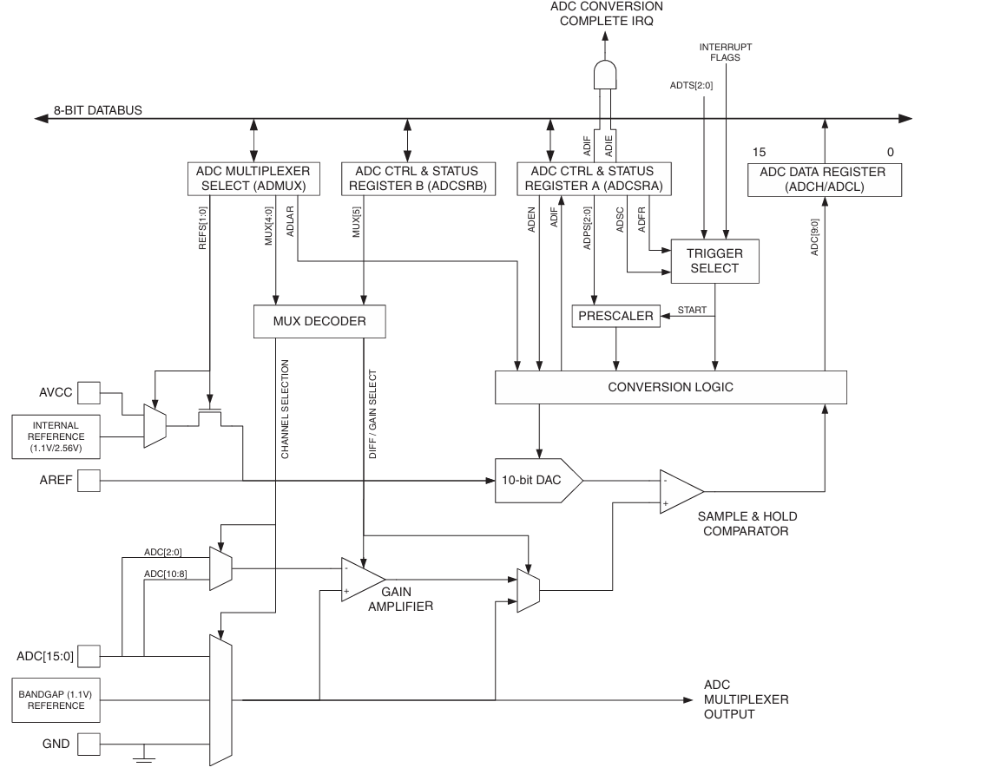

# ADC

The Analog Digital Converter (ADC) used by the Jade M1 Board is a 10bit ADC. The ADC was used to develop the Voltmeter side of the board.

The ADC was configured to run on channel 0, using AVCC as refference. The prescalar was set to 128 to align it's clock frequency with the recommended range of 50 - 200kHz. It was used with the polling method, not with interrupts.

