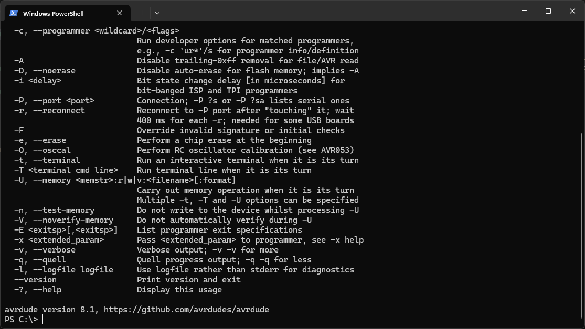

# Setting up AVRDUDE
This project was developed using Windows 11. As such, AVRDUDE was downloaded and set up for that OS.

Access the [Release](https://github.com/avrdudes/avrdude/releases) tab of the official GitHub Repo and download the latest version of AVRDUDE, for Windows. Unpack the files on the C drive, or any equivalent drive, but in an easy to access folder.

Now we need to add the tool to path. Pressing the Windows key and searchinig for "edit environment variables" should bring up the menu to add the tool to path. Click on Path, then Edit. Click New, to create a new entry, then Browse and select the folder where you extracted the downloaded files from the release tab. Click OK to exit and open a terminal, to test if the set up was successful

Simply typing "avrdude" and hitting enter should return this:

