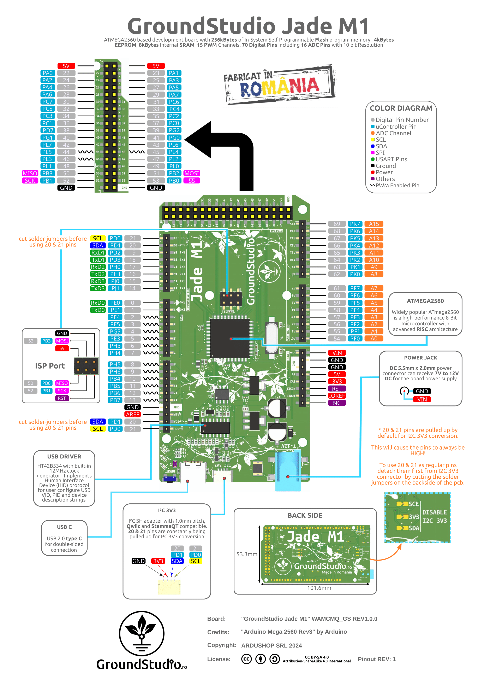

# Development Platform

The development platform used for this project is a GroundStudio Jade M1 Board, featuring an ATMega 2560. The Board runs at a frequency of 16MHz, but this is enough for this project.

It offers generous resources for a embedded applications and for this project we made use of the ADC, SPI controller and many GPIO pins for buttons and display control.

|Pin|Function|Description|
|---|--------|-----------|
|PD0|Cursor Left|Moves the cursor to the previous recorded point|
|PD1|Cursor Right|Moves the cursor to the next recorded point|
|PD2|Touch IRQ|Pin used for Touchscreen ISR|
|PD3|Voltage Toggle|Toggles between High Voltage and Low Voltage|
|PE3|Start Button|Enables the ADC and starts the system|
|PB4|Display DC|Data/Control Pin for the display|
|PB5|Display Reset|Pin used for Display Reset|
|PB6|Display CS|Display Chip Select Pin used to signal SPI communication to the display|
|PB7|Touchscreen CS|Touchscreen Chip Select Pin used to signal SPI communication with the XPT2046|
|PF0|ADC Input|Channel 0 for the board's ADC used as Voltmeter Input|
|PB1|SPI SCK|Clock Pin for SPI communication|
|PB2|SPI MOSI|MOSI Pin for SPI communication|
|PB3|Touchscreen MISO|MISO Pin used by XPT2046|

# Perf Board

For the hardware part, it is recomended to solder the components to a Perf Board. This is a schematic to use for placing the components.

