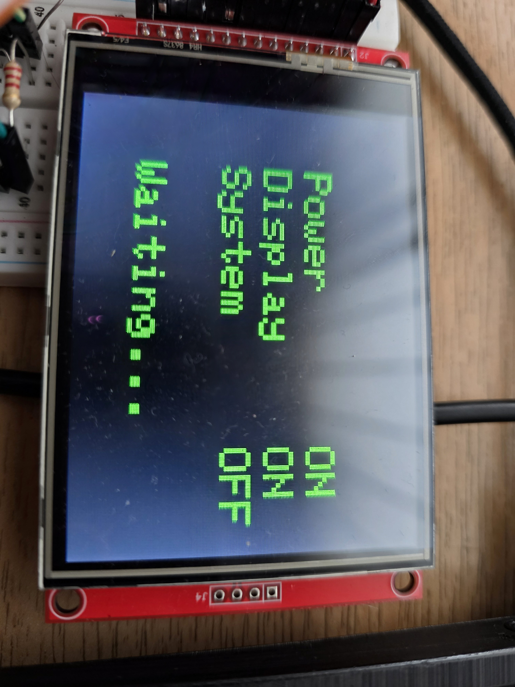
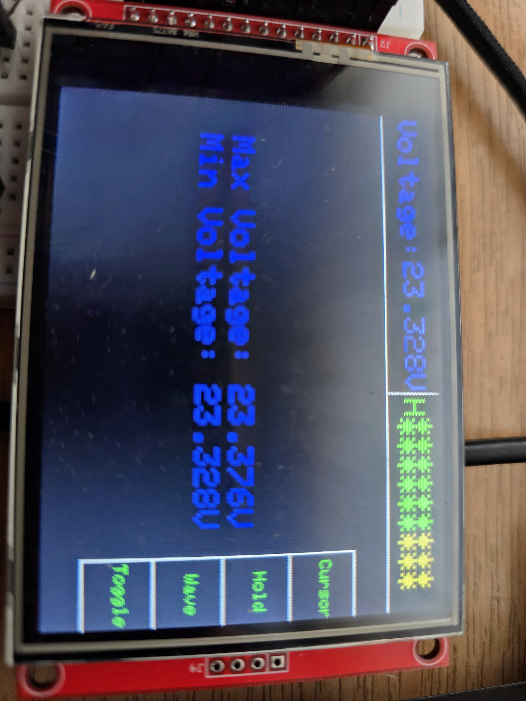
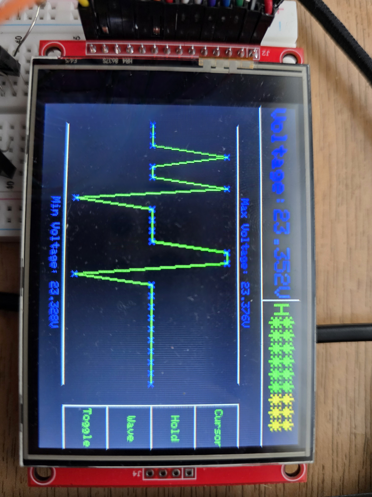
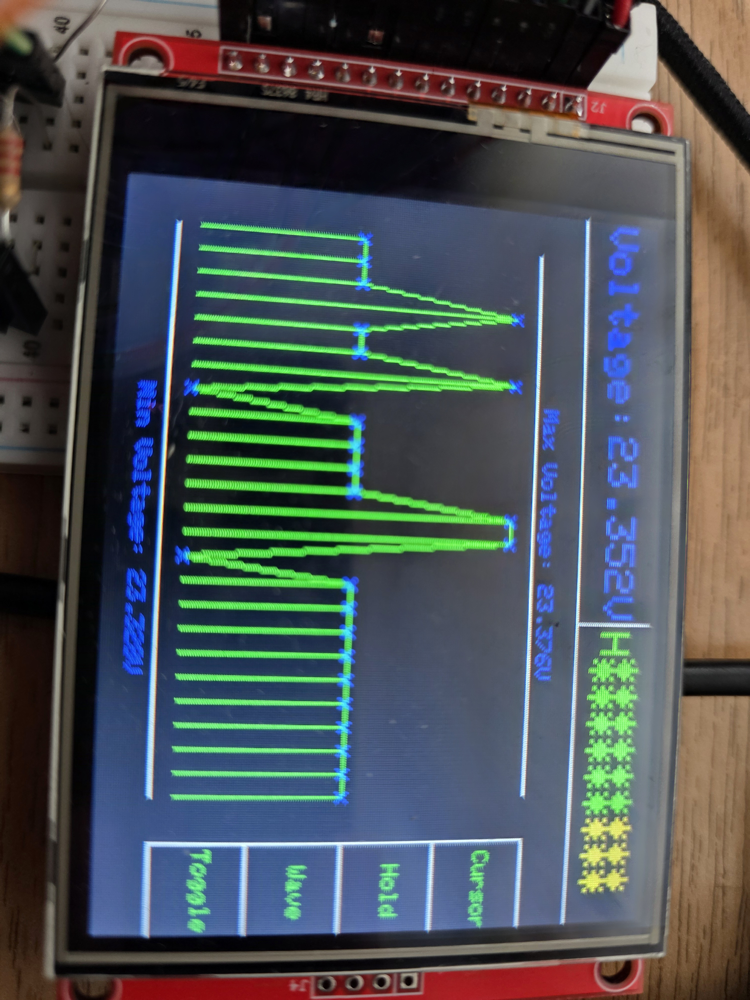
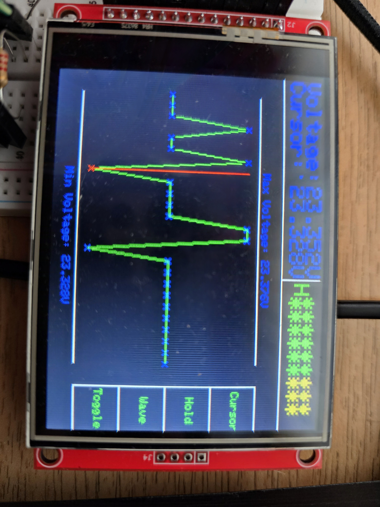
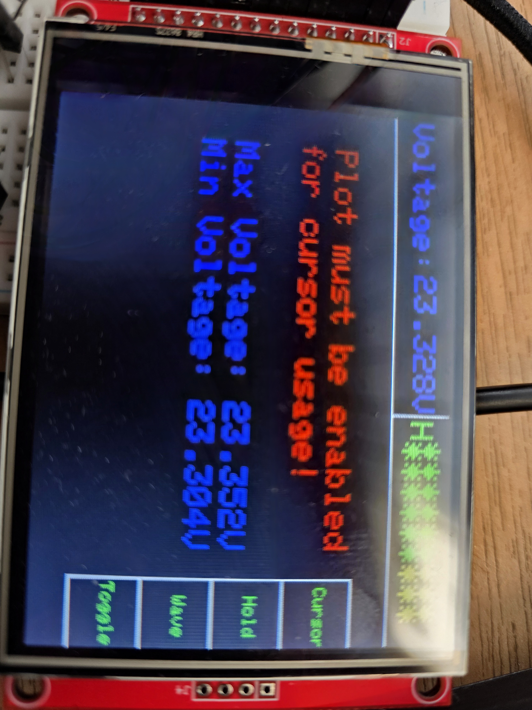
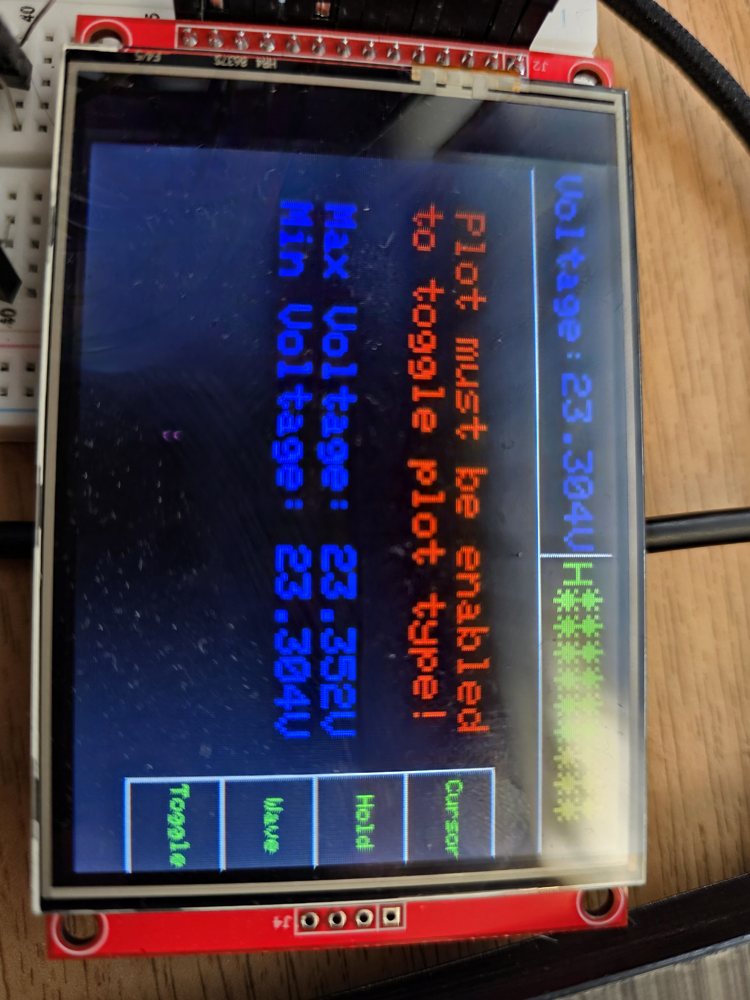

# Display

The display used in this project uses an ILI9341 controller and an XPT2046 for resistive touchscreen. It communicates with the board over SPI and it has a resolution of 340x240.

## The defined UI

When you first power on the board, you are greeted with this screen

After pressing the start button, we enter the Voltmeter mode, where we can measure signal and up to 25 values are recorded. The UI looks like in the following image.

On the top, left side of the UI is the Voltmeter area. When the cursor is turned on, the voltmeter measurement gets pushed slightly upward to make space for the cursor measurement. On the right side, also on top, we can have the area which specifies the Voltage Type (H or L) and the indicator "LEDs" which tell, in a visual manner, the amount of voltage measured. One LED turns on every 2.4V. The last LED is red, to signal maximum voltage, while the previous 3 LEDs are orange, to signal we are close to the maximum voltage.

On the right side we have the touch buttons, while in the middle, we have the Waveform Viewer area. When the Waveform Viewer is turned off, most of the space is taken by the measurements for the maximum and minimum value for the recorded points.

When the Waveform Viewer is turned on, two horizontal lines appear on the screen to mark the limits of the Waveform Viewer, on top and bottom. The measurements for the minimum and maximum value get moved to their respective line and the text gets scaled down. They are now used as the upper and lower range for the Waveform Viewer, which has auto-scaling.

The Waveform Viewer has two modes, a simple mode, where the points are plotted and just connected with dots, and a digital mode, where the samples are also drawn (vertical lines to the points)

## Touchscreen Buttons

The button menu on the right side contains the following buttons:

- Cursor
- Hold
- Wave
- Toggle

### Cursor

The cursor button enables and disables the cursor. The cursor is a vertical line which can be moved to the left or to the right of the screen using the designated physical buttons, always ending up on a recorded point. It is used to see the voltage of the selected point inside the voltmeter area.

When pressed while the Waveform Viewer is turned off, a warning message appears, informing the user that the cursor cannot be used without that feature.

### Hold

The hold button halts voltage recording, making the Waveform Viewer keep the current form. This feature is useful when paired with the cursor, to check up on signal variations.

### Wave

The wave button enables or disables the Waveform Viewer. The Waveform Viewer enables the user to see the form of the signal, up to 25 previous points. This feature is useful for detecting changes in signal strenght and, as stated before, it works best when paired with the cursor and the hold feature.

### Toggle

The toggle button is used to toggle between the two modes for the Waveform Viewer. Similar to the cursor button, when pressed while the Waveform Viewer is turned off, a warning message appears, informing the user that the toggle button cannot be used without that feature.

