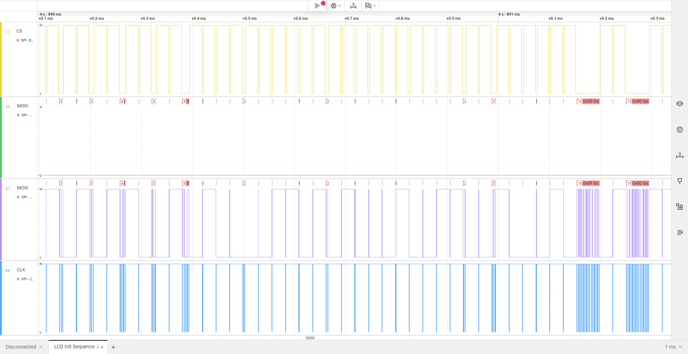
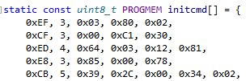
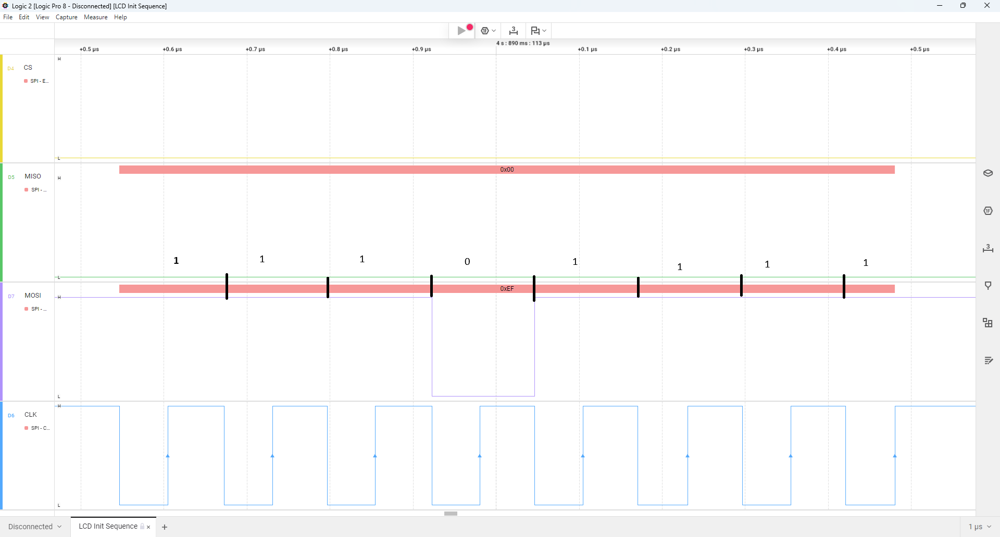
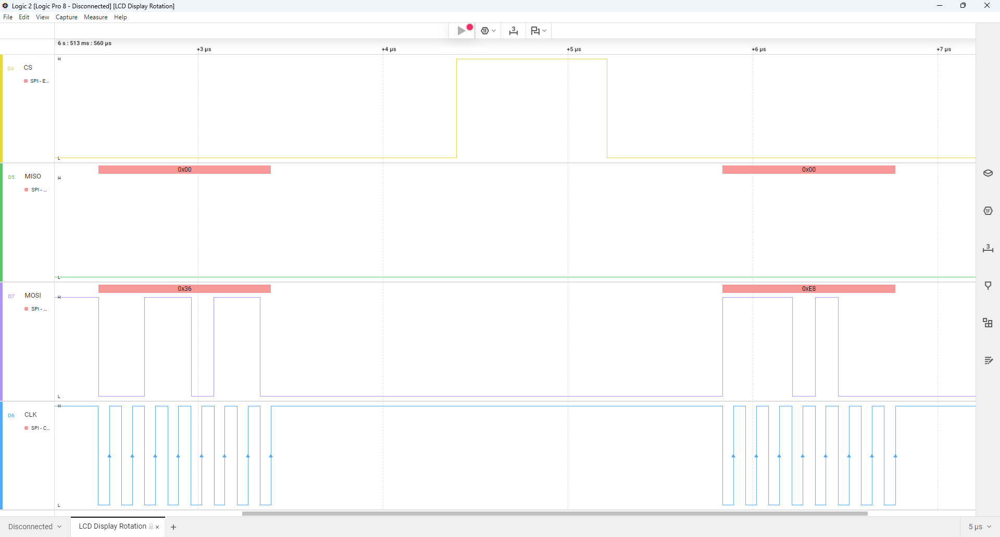
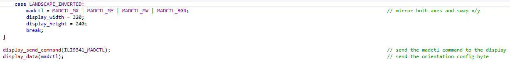

# SPI

The Spi peripheral was used to communicate with ILI9341 display controller and XPT2046 touchscreen controller. It was configured to run using:

- CPOL
- CPHA
- Double speed (SPI2X, 8MHz)
- Pull-up disabled for MOSI

## Display Initialization Sequence

Using a logic analizer we can see the waveform for the SPI communication during display initialization:

Because the initialization sequence is quite long, a zoomed version, like the one below, is much more useful. Here we can see the bytes being sent and we can compare with the actual initialization code.

.

Since we are using an Adafruit display, the init sequence uses the same Adafruit initialization matrix. This is a crop of that sequence, to compare against the waveform viewed with the logic analizer.

We can see the the zoomed in sequence captured with the logic analizer matches the first line of the initiazliation command.

### Spi Transfer

To further analize how the SPI transfer works, we can zoom in on one of the bytes:

Here we can see each bit being sent over SPI: ``0xEF = 1110_1111``

## Set Display Rotation

The logic analizer was also used to show the SPI transfer for setting the display rotation.

We can compare this against the actual code:

The system uses Inverted Landscape view. As such, we need to see the values of `ILI9341_MADCTL`, which is the reg that handles display rotation and the result of `MADCTL_MX | MADCTL_MY | MADCTL_MV | MADCTL_BGR`.

The result of that operation is: ``0x80 | 0x40 | 0x20 | 0x08 = 0xE8``